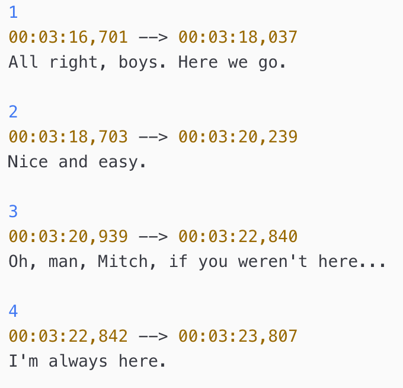

# atom-package-language-subriptext

Syntax Highlighting Package for SubRip Text `.srt` files in [Atom](https://atom.io).

## What is an *SRT file*?

An `SRT` file is a subtitle file saved in the SubRip file format. It is supported by several video formats such as DivX and DVD and used by various video playback programs. SRT files contain subtitle information, which includes the sequential number of subtitles, start and end timecode, subtitle text.

### More Information about SRT format

The timecode format featured in SRT files is hours, minutes, seconds, and milliseconds, which appears like this: `HH:MM:SS,MIL`. Display coordinates for the subtitle may appear after the end timecode.

**NOTE**: SRT files are text files used in video playback. Therefore, they do not contain any video data.

### Common SRT Filenames

Subtitle files are often named according to the language of the subtitles.

`moviename.eng.srt` - this is an SRT file with English subtitles.
